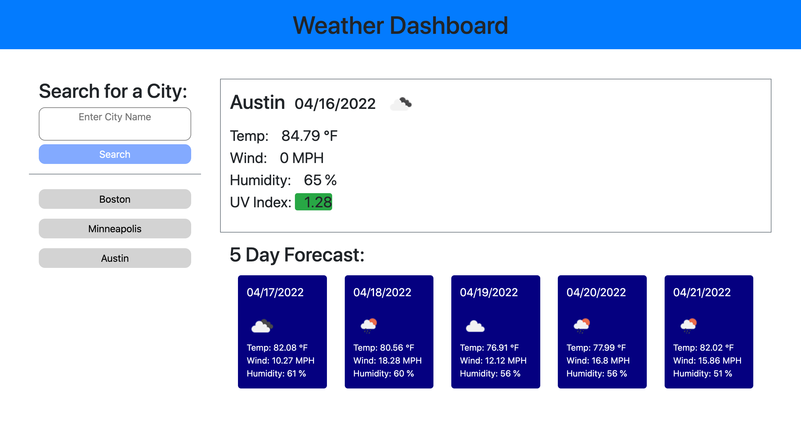

# Weather Dashboard

## Purpose

This Weather Dashboard application has been developed to allow travelers to check weather conditions (current & future) in their desired destination. 

As a developer, this project enhanced my understanding of API's, fetch calls, and the various ways to use outside sources (API's & libraries) to fill functional and stylistic gaps in my applications.

### Given User Story

AS A traveler I WANT to see the weather outlook for multiple cities SO THAT I can plan a trip accordingly.

### This application has been developed to:

1. When user searches for a city by name
2. Present them with current and future conditions for that city
3. Presented conditions include: the date, an icon representation of weather conditions, the temperature, the humidity, the wind speed, and the UV index
4. Save all user searches for reuse
5. When user clicks on a city in the search history, they are again presented with current and future conditions for that city

## Application Details

This application is optimized for deployment on the following screen sizes using Bootstrap: 550px, 770px, 890px, and 1200px  

### JavaScript Logic Summary

- On document.ready, first check local storage to see if user has any saved cities. If true, retrieve them and create buttons for each one.
- On click of the search button, get the value of the user input (the city name), add it to local storage, and pass it to the checkWeather function.
- checkWeather function sends the city name to the first OpenWeather call, which returns the latitude and longitude for the requested city. We then pass the lat & lon to the coordinateFetch function.
- coordinateFetch function returns actual weather data, which we select out of the returned objects.
- For the current conditions: we update the textContent of each hardcoded list item to the corresponding data returned by coordinateFetch.
- For the five day forecast: we loop through the forecastArr, which is the 8-day forecast returned by coordinateFetch. On each iteration we pull out the desired data, package it up as an object, and push it to the fiveDayForecastArr. fiveDayForecastArr is then passed through the generateForecast function.
- The generateForecast function loops through the array, creates elements and appends them to the container. 

### Main Files in Repository

- index.html
- script.js
- style.css

This application mainly utilizes Bootstrap styles, which are overridden in some places via style.css. 

Other libraries utilized are JQuery & Day.js.

Both API calls fetch from OpenWeather.

## Deployed Application

[(Link to deployed application)](https://emmazart.github.io/weather-dashboard/)

### Screenshot of Deployed Application:

